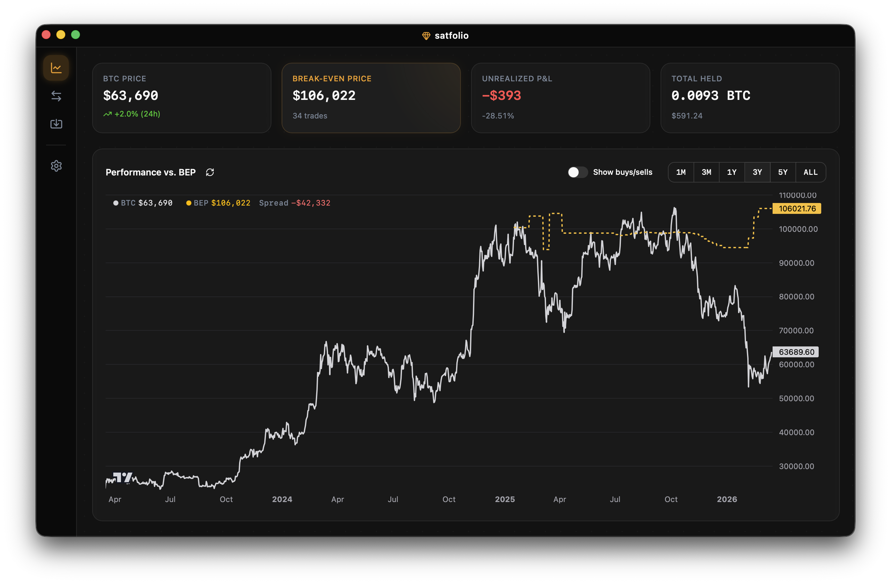

<h1> Satfolio
  <a href="https://github.com/guillevc/satfolio/actions/workflows/ci.yaml"></a>
  <a href="https://github.com/guillevc/satfolio/releases/latest"></a>
  <a href="https://github.com/guillevc/satfolio/releases/latest"></a>
  <a href="https://github.com/guillevc/satfolio/releases/latest"></a>
  
  <a href="https://github.com/guillevc/satfolio/attestations"></a>
</h1>

Know exactly where you stand with your Bitcoin. Import trades from Kraken or Coinbase and see your break-even price, P&L, and total position — calculated and stored locally on your machine, no accounts or cloud required.



## Features

- **Import trades** from Kraken and Coinbase CSV exports — re-import safely without duplicates
- **Dashboard** showing current BTC price, break-even price, total holdings, and unrealized P&L
- **Price chart** with daily prices, break-even line, and trade markers
- **Trade history** table with running break-even price and realized P&L per trade
- **Multi-currency** — supports EUR, USD, and GBP, formatted for your locale
- **Auto-update** — get notified when a new version is available and install it without leaving the app
- **Private by default** — no accounts, no analytics, no telemetry. Your data never leaves your machine. The app connects to the internet for two things only: live BTC price (Kraken public API) and update checks (GitHub Releases).

## Install

Download the latest release from the [Releases](https://github.com/guillevc/satfolio/releases) page.

| Platform              | File                             |
| --------------------- | -------------------------------- |
| macOS (Apple Silicon) | `Satfolio_<version>_aarch64.dmg` |
| macOS (Intel)         | `Satfolio_<version>_x64.dmg`     |
| Linux (x64)           | `.deb`, `.rpm`, or `.AppImage`   |

### macOS

> [!NOTE]
> macOS shows a warning because Satfolio isn't signed through Apple's paid developer program. The app is open source and every release is verifiably built from this repo — see [Security & trust](#security--trust).

1. Open the `.dmg` and drag Satfolio to **Applications**
2. Try to open Satfolio — macOS will show a warning and block it
3. Open **System Settings → Privacy & Security**
4. Under Security, click **Open Anyway**
5. Enter your login password and click **OK**

This is only needed once — after that, Satfolio opens normally. See [Apple's support page](https://support.apple.com/guide/mac-help/open-a-mac-app-from-an-unknown-developer-mh40616/mac) for more details.

Alternatively, run this in Terminal:

```sh
xattr -d com.apple.quarantine /Applications/Satfolio.app
```

## Security & trust

This project is free and open source. Apple's Developer Program costs 99€/year, so instead of paying for a code signature, every release is built transparently in public CI and cryptographically signed via [Sigstore](https://www.sigstore.dev).

Each binary has a [build provenance attestation](https://docs.github.com/en/actions/security-for-github-actions/using-artifact-attestations) so you can verify exactly how it was built.

```sh
# verify your download matches the checksum shown in the release assets
shasum -a 256 <filename>

# verify the binary was built from this repo's source code (requires GitHub CLI)
gh attestation verify <filename> --owner guillevc
```

## Build from source

```sh
git clone https://github.com/guillevc/satfolio.git
cd satfolio
mise install      # install toolchain (node, pnpm, rust, just)
just install      # install frontend dependencies
just build        # build the Tauri app
```

Requires [mise](https://mise.jdx.dev) (or manually: just, Rust, Node.js, pnpm) and [Tauri 2 prerequisites](https://v2.tauri.app/start/prerequisites/).

## Development

After cloning and running `mise install` and `just install` (see [Build from source](#build-from-source)):

```sh
just dev       # run in development mode
just check     # typecheck + lint + format check
just test      # run all tests
```

Run `just` to see all available recipes.

## Support

If you find Satfolio useful, consider supporting its development:

<p>
  <a href="https://ko-fi.com/guillevc" target="_blank"></a>
  <a href="https://github.com/sponsors/guillevc"></a>
</p>

**Bitcoin:**

<table>
  <tr>
    <td align="center">
      <strong>Lightning</strong><br />
      <code>guille@guillevc.dev</code><br /><br />
      
    </td>
    <td align="center">
      <strong>On-chain</strong><br />
      <code>bc1q3hvgvmw9qpqvl0z6r9uqdz3v5405xdgwt44pgq</code><br /><br />
      
    </td>
  </tr>
</table>

## License

[AGPL-3.0](LICENSE)
